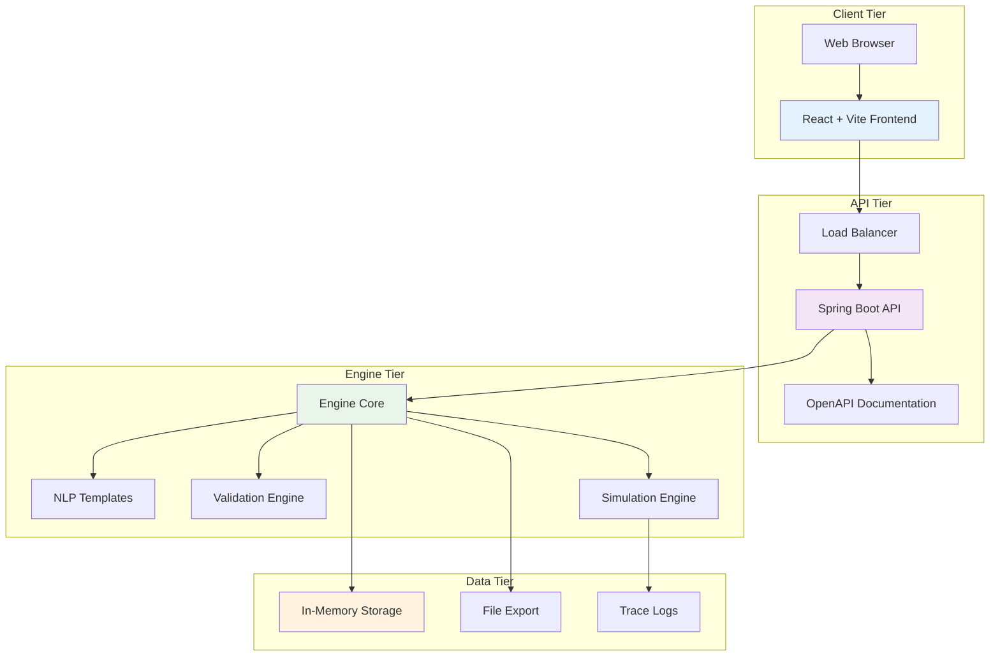
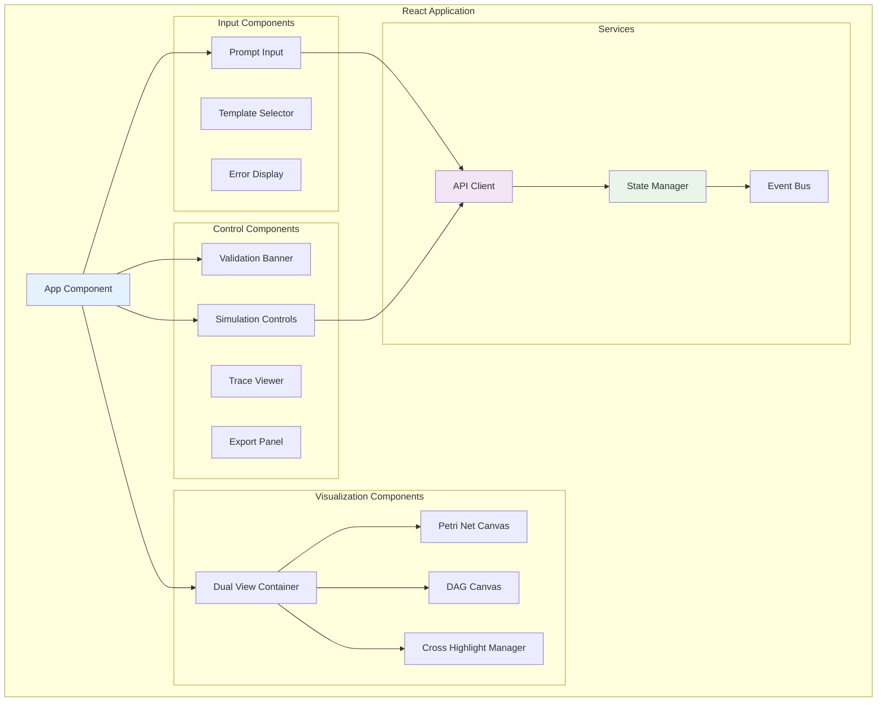
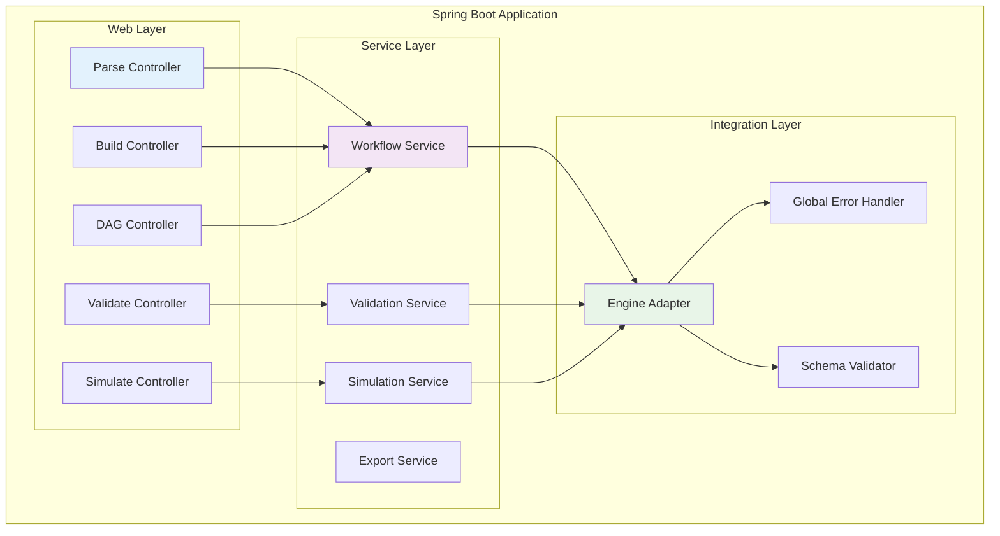
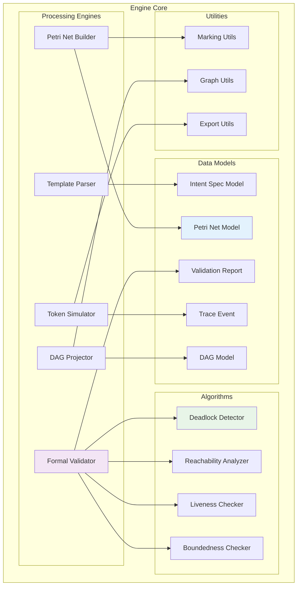
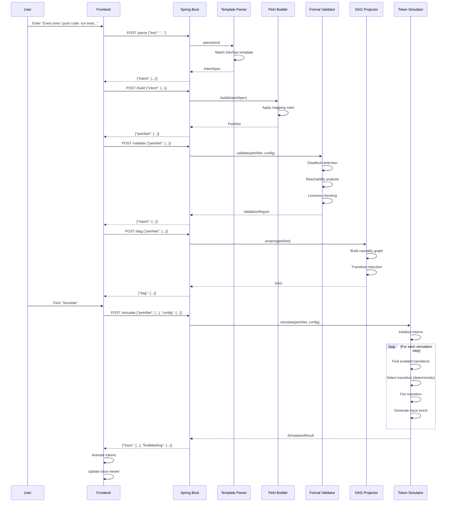
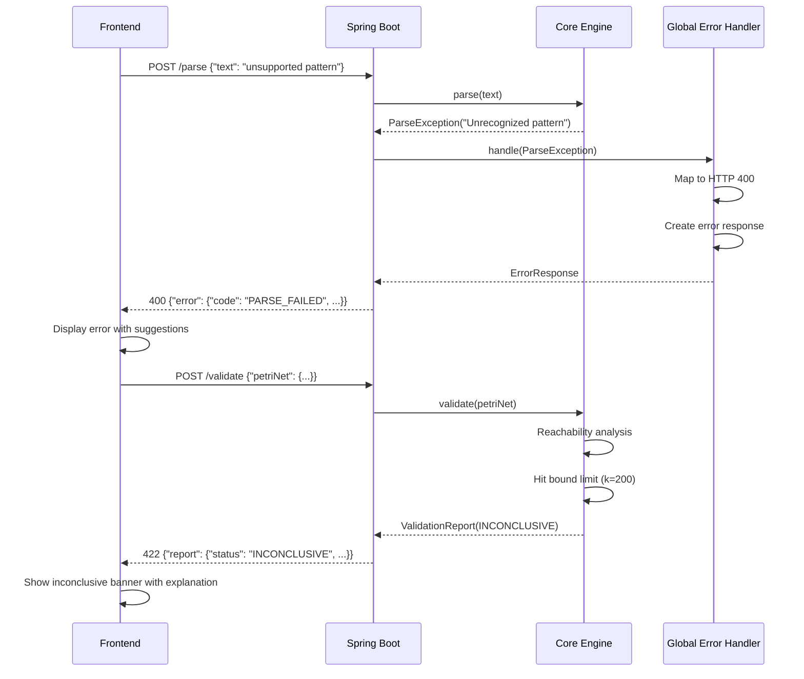
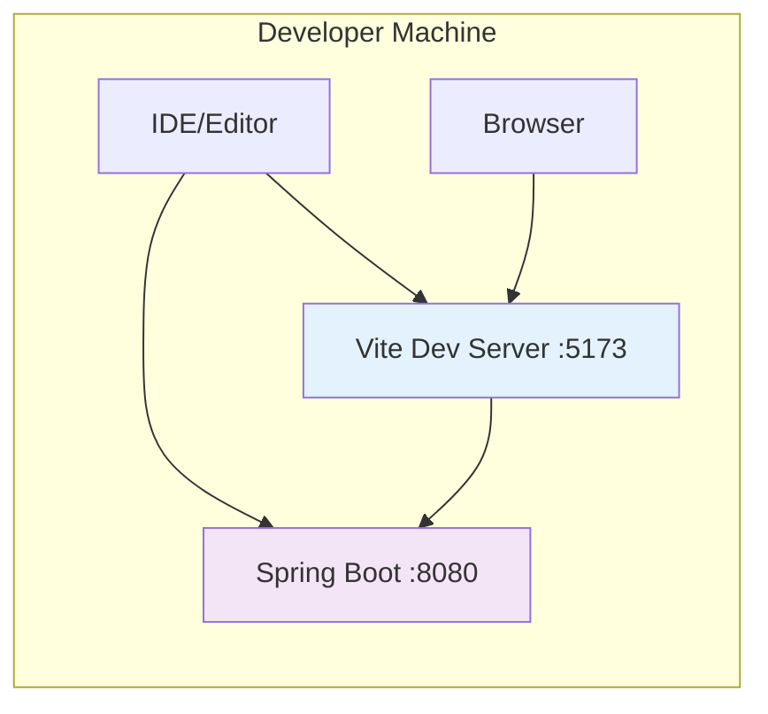
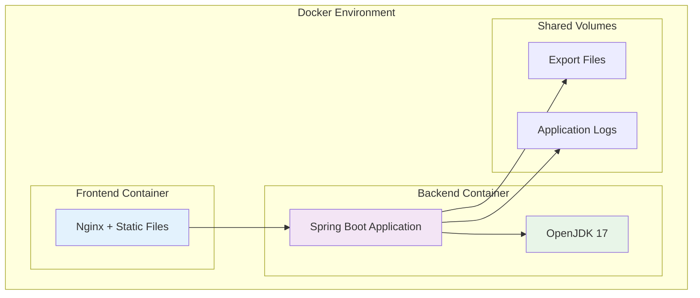
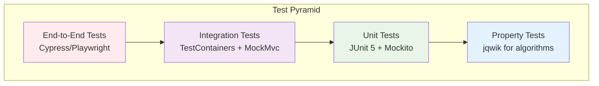

# Technical Architecture: Petri Net DAG System

## System Overview

The Petri Net DAG system is architected as a modern web application with a clear separation between frontend presentation, backend API services, and core engine logic. The architecture prioritizes modularity, testability, and clear data flow while maintaining the formal rigor required for mathematical workflow validation.

## High-Level Architecture



## Component Architecture

### Frontend Components (React + Vite)



### Backend Services (Spring Boot)



### Core Engine Architecture



## Data Models and Schemas

### Core Data Structures

#### Petri Net Model
```java
public class PetriNet {
    private String netId;
    private String name;
    private List<Place> places;
    private List<Transition> transitions;
    private List<Arc> arcs;
    private Marking initialMarking;
    private String schemaVersion;
    
    // Derived properties
    public Set<Transition> getEnabledTransitions(Marking marking);
    public Marking fire(Transition transition, Marking marking);
    public boolean isTerminal(Marking marking);
}

public class Place {
    private String id;
    private String name;
    private Integer capacity; // null = unbounded
    private Map<String, Object> metadata;
}

public class Transition {
    private String id;
    private String name;
    private Map<String, Object> guards;
    private Map<String, Object> metadata;
}

public class Arc {
    private String fromId;
    private String toId;
    private int weight;
    private ArcType type; // PLACE_TO_TRANSITION, TRANSITION_TO_PLACE
}
```

#### Intent Specification
```java
public class IntentSpec {
    private String name;
    private String description;
    private List<IntentStep> steps;
    private Map<String, Object> metadata;
    private String schemaVersion;
}

public class IntentStep {
    private String id;
    private StepType type; // ACTION, CHOICE, PARALLEL, SYNC
    private String description;
    private List<String> dependencies;
    private Map<String, Object> conditions;
    private Map<String, Object> metadata;
}
```

#### Validation Report
```java
public class ValidationReport {
    private ValidationStatus status;
    private Map<String, CheckResult> checks;
    private Optional<CounterExample> counterExample;
    private List<String> hints;
    private ValidationConfig config;
    private ValidationMetrics metrics;
    private String schemaVersion;
}

public class CheckResult {
    private String checkName;
    private CheckStatus status;
    private String description;
    private Map<String, Object> details;
    private Optional<String> witness;
}

public class CounterExample {
    private Marking marking;
    private Set<String> enabledTransitions;
    private List<String> pathToReach;
    private String explanation;
}
```

### JSON Schema Definitions

#### IntentSpec Schema
```json
{
  "$schema": "http://json-schema.org/draft-07/schema#",
  "type": "object",
  "properties": {
    "schemaVersion": {"type": "string", "const": "1.0"},
    "name": {"type": "string"},
    "description": {"type": "string"},
    "steps": {
      "type": "array",
      "items": {
        "type": "object",
        "properties": {
          "id": {"type": "string"},
          "type": {"enum": ["action", "choice", "parallel", "sync"]},
          "description": {"type": "string"},
          "dependencies": {"type": "array", "items": {"type": "string"}},
          "conditions": {"type": "object"},
          "metadata": {"type": "object"}
        },
        "required": ["id", "type"]
      }
    }
  },
  "required": ["schemaVersion", "name", "steps"]
}
```

#### PetriNet Schema
```json
{
  "$schema": "http://json-schema.org/draft-07/schema#",
  "type": "object",
  "properties": {
    "schemaVersion": {"type": "string", "const": "1.0"},
    "netId": {"type": "string"},
    "name": {"type": "string"},
    "places": {
      "type": "array",
      "items": {
        "type": "object",
        "properties": {
          "id": {"type": "string"},
          "name": {"type": "string"},
          "capacity": {"type": ["integer", "null"], "minimum": 1}
        },
        "required": ["id"]
      }
    },
    "transitions": {
      "type": "array",
      "items": {
        "type": "object",
        "properties": {
          "id": {"type": "string"},
          "name": {"type": "string"}
        },
        "required": ["id"]
      }
    },
    "arcs": {
      "type": "array",
      "items": {
        "type": "object",
        "properties": {
          "fromId": {"type": "string"},
          "toId": {"type": "string"},
          "weight": {"type": "integer", "minimum": 1}
        },
        "required": ["fromId", "toId", "weight"]
      }
    },
    "initialMarking": {
      "type": "object",
      "patternProperties": {
        "^p_": {"type": "integer", "minimum": 0}
      }
    }
  },
  "required": ["schemaVersion", "netId", "places", "transitions", "arcs", "initialMarking"]
}
```

## Sequence Diagrams

### Complete Workflow Processing



### Error Handling Flow



## Technology Stack

### Frontend Stack
- **Framework**: React 18 with TypeScript
- **Build Tool**: Vite for fast development and optimized builds
- **Graph Visualization**: Cytoscape.js for interactive network diagrams
- **State Management**: React Context + useReducer for application state
- **HTTP Client**: Axios with request/response interceptors
- **Styling**: CSS Modules with SCSS for component styling
- **Testing**: Vitest + React Testing Library for unit/integration tests

### Backend Stack
- **Framework**: Spring Boot 3.2 with Java 17
- **Web Layer**: Spring MVC with embedded Tomcat
- **Validation**: Bean Validation (JSR-303) with custom validators
- **Documentation**: OpenAPI 3 with Swagger UI
- **Testing**: JUnit 5 + Mockito + TestContainers for integration tests
- **Build Tool**: Maven with multi-module structure
- **Logging**: SLF4J with Logback for structured logging

### Core Engine Stack
- **Language**: Java 17 with modern language features
- **Collections**: Eclipse Collections for high-performance data structures
- **Algorithms**: Custom implementations optimized for Petri net operations
- **Serialization**: Jackson for JSON processing with custom serializers
- **Validation**: Custom formal verification algorithms
- **Testing**: Property-based testing with jqwik for algorithm verification

## Deployment Architecture

### Local Development



### Docker Deployment



## Security Architecture

### POC Security Model
- **Authentication**: None (POC warning displayed prominently)
- **Authorization**: Single-user, local deployment only
- **Input Validation**: Strict schema validation for all API inputs
- **Output Sanitization**: No user-generated content in responses
- **Data Privacy**: No PII collection, local-only trace storage

### Security Headers
```http
X-Content-Type-Options: nosniff
X-Frame-Options: DENY
X-XSS-Protection: 1; mode=block
Content-Security-Policy: default-src 'self'
POC-Warning: This is a proof-of-concept. Do not expose publicly.
```

## Performance Architecture

### Frontend Performance
- **Code Splitting**: Lazy loading of visualization components
- **Memoization**: React.memo for expensive graph rendering
- **Virtual Scrolling**: For large trace event lists
- **Debounced Input**: Prevent excessive API calls during typing
- **Canvas Optimization**: Efficient redraw strategies for token animation

### Backend Performance
- **Connection Pooling**: Optimized for single-user load
- **Caching**: In-memory caching of validation results
- **Async Processing**: Non-blocking simulation execution
- **Resource Limits**: Bounded algorithms prevent resource exhaustion
- **Monitoring**: JVM metrics and response time tracking

### Algorithm Performance
- **Bounded Exploration**: Configurable limits prevent infinite loops
- **Early Termination**: Stop validation on first failure/success
- **Efficient Data Structures**: Optimized for graph operations
- **Memory Management**: Careful object lifecycle management
- **Profiling**: Built-in performance metrics collection

## Monitoring and Observability

### Application Metrics
- **Response Times**: P50, P95, P99 for all API endpoints
- **Error Rates**: 4xx and 5xx response tracking
- **Validation Performance**: States explored, time taken
- **Simulation Metrics**: Steps executed, trace size
- **Memory Usage**: JVM heap and garbage collection metrics

### Logging Strategy
```java
// Structured logging with correlation IDs
log.info("Validation started", 
    kv("netId", petriNet.getNetId()),
    kv("kBound", config.getKBound()),
    kv("correlationId", correlationId));

log.info("Validation completed",
    kv("netId", petriNet.getNetId()),
    kv("status", report.getStatus()),
    kv("statesExplored", report.getMetrics().getStatesExplored()),
    kv("durationMs", duration),
    kv("correlationId", correlationId));
```

### Health Checks
- **API Health**: Basic connectivity and response validation
- **Engine Health**: Core algorithm functionality verification
- **Memory Health**: JVM memory usage and GC pressure
- **Performance Health**: Response time degradation detection

## Testing Architecture

### Test Pyramid



### Test Data Management
- **Golden Files**: Reference outputs for validation reports and traces
- **Test Fixtures**: Reusable Petri net and IntentSpec objects
- **Random Generation**: Property-based testing with controlled randomness
- **Snapshot Testing**: Automated comparison of complex output structures

## Future Architecture Considerations

### Scalability Enhancements
- **Microservices**: Split parsing, validation, and simulation into separate services
- **Event Sourcing**: Track all workflow modifications and validations
- **CQRS**: Separate read/write models for complex workflow queries
- **Caching Layer**: Redis for shared validation results and user sessions

### Advanced Features
- **Plugin Architecture**: Dynamic loading of domain-specific templates
- **Workflow Versioning**: Track changes and enable rollback capabilities
- **Collaborative Editing**: Real-time multi-user workflow design
- **AI Integration**: LLM-powered natural language understanding

### Production Readiness
- **Authentication**: OAuth2/OIDC integration with role-based access
- **Multi-tenancy**: Isolated workspaces with resource quotas
- **Audit Logging**: Comprehensive tracking of all user actions
- **Backup/Recovery**: Persistent storage with automated backups

This architecture provides a solid foundation for the POC while maintaining clear extension points for future production deployment and feature enhancement.