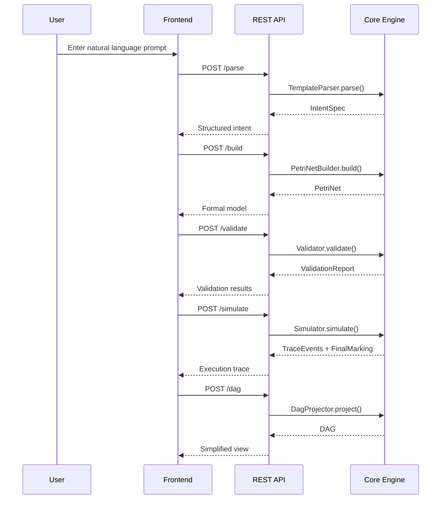

# POC Specification: Natural Language to Petri Net DAG System

## Executive Summary

This document specifies a proof-of-concept system that demonstrates the transformation of natural language workflow descriptions into formal Petri nets, validates them using formal methods, and provides dual visualization as both Petri nets and DAGs with simulation capabilities.

The POC validates Obvian's core hypothesis: that natural language can be reliably transformed into formally verified, traceable workflows that provide mathematical guarantees about system behavior.

## Scope and Boundaries

### In Scope
- **Natural Language Parsing**: Template-based parsing for DevOps CI/CD and Football training scenarios
- **Petri Net Construction**: Formal modeling with places, transitions, arcs, and initial markings
- **Formal Validation**: Deadlock detection, reachability analysis, liveness checking, and boundedness verification
- **DAG Projection**: Simplified visualization maintaining execution semantics
- **Token Simulation**: Deterministic and interactive execution with comprehensive tracing
- **Dual Visualization**: Synchronized Petri net and DAG views with cross-highlighting
- **Export Capabilities**: JSON artifacts, Mermaid diagrams, and trace logs

### Out of Scope (Future Phases)
- Real plugin integrations beyond mock templates
- Authentication, authorization, or multi-tenant architecture
- Persistence beyond local file export
- Advanced natural language understanding (LLM integration)
- Production scalability or performance optimization
- Marketplace or plugin distribution systems
- Multi-agent learning loops or AI optimization

## Technical Architecture

### System Overview

```mermaid
graph TB
    subgraph "User Interface (React + Vite)"
        UI[Prompt Input]
        DualView[Petri Net | DAG Views]
        Controls[Simulation Controls]
        Trace[Trace Viewer]
        Export[Export Panel]
    end
    
    subgraph "REST API (Spring Boot)"
        Parse[/parse]
        Build[/build]
        Validate[/validate]
        Simulate[/simulate]
        DAG[/dag]
    end
    
    subgraph "Core Engine (Java 17)"
        NLP[Template Parser]
        Builder[Petri Net Builder]
        Validator[Formal Validator]
        Projector[DAG Projector]
        Simulator[Token Simulator]
    end
    
    UI --> Parse
    DualView --> Build
    Controls --> Validate
    Controls --> Simulate
    DualView --> DAG
    
    Parse --> NLP
    Build --> Builder
    Validate --> Validator
    Simulate --> Simulator
    DAG --> Projector
```

### Data Flow Sequence



## Core Components

### 1. Template-Based Natural Language Parser

**Purpose**: Transform natural language workflow descriptions into structured IntentSpec objects using pattern matching and slot filling.

**Supported Templates**:

#### DevOps CI/CD Template
- **Pattern**: `"Every time I push code: run tests; if pass deploy to staging; if fail alert Slack"`
- **Recognition**: Sequential actions with conditional branching
- **Output**: IntentSpec with action nodes and XOR-choice structure

#### Football Training Template  
- **Pattern**: `"Warm-up, then pass and shoot in parallel, then cooldown"`
- **Recognition**: Sequential start, parallel execution, synchronized completion
- **Output**: IntentSpec with AND-split/join structure

**Implementation**:
```java
public interface TemplateParser {
    ParseResult parse(String naturalLanguagePrompt);
}

public class ParseResult {
    private boolean success;
    private IntentSpec intentSpec;
    private List<String> errors;
    private List<String> suggestions;
}
```

### 2. Petri Net Builder

**Purpose**: Convert structured IntentSpec into formal Petri net representation with mathematically precise semantics.

**Mapping Rules**:
- **Action** → Transition with pre/post places
- **Sequence A→B** → Arc from post(A) to pre(B)
- **AND-split/join** → Fork place produces tokens for parallel branches; join as transition with multiple inputs
- **XOR Choice** → Single pre-place to multiple transitions with guards
- **Synchronization** → Transition requiring tokens from all input places

**Formal Semantics**:
- **Enabled Rule**: Transition t enabled iff ∀ input place p: M(p) ≥ w(p→t)
- **Capacity Rule**: Firing allowed iff ∀ output place q: M(q) + w(t→q) ≤ cap(q)
- **Firing Effect**: M' = M − Σ_in w(p→t) + Σ_out w(t→q)

### 3. Formal Validator

**Purpose**: Perform mathematical verification of Petri net properties to ensure workflow correctness.

**Validation Algorithms**:

#### Deadlock Detection
- **Definition**: Marking with no enabled transitions that is not terminal
- **Algorithm**: Check each reachable marking for enabled transitions
- **Output**: FAIL with witness marking if deadlock found

#### Reachability Analysis
- **Definition**: Verify terminal markings are reachable from initial state
- **Algorithm**: Bounded BFS/DFS over marking graph (k=200 states, configurable)
- **Output**: PASS if terminal reachable, INCONCLUSIVE if bound reached

#### Liveness Checking
- **Definition**: No transition permanently disabled in all reachable markings
- **Algorithm**: Track transition enablement during reachability exploration
- **Output**: FAIL if any transition never enabled

#### Boundedness Verification
- **Definition**: Token count per place stays within configured limits
- **Algorithm**: Monitor place capacities during state exploration
- **Output**: FAIL if any place exceeds capacity

**Validation Report Structure**:
```json
{
  "status": "PASS|FAIL|INCONCLUSIVE",
  "checks": {
    "deadlock": {"result": "PASS", "details": "..."},
    "reachability": {"result": "PASS", "statesExplored": 45},
    "liveness": {"result": "PASS", "transitions": ["t1", "t2"]},
    "boundedness": {"result": "PASS", "maxTokens": {"p1": 2, "p2": 1}}
  },
  "counterExample": {
    "marking": {"p1": 1, "p2": 0},
    "enabledTransitions": [],
    "pathToReach": ["t_start", "t_branch"]
  },
  "hints": ["Add AND-join before t_cooldown to prevent premature completion"]
}
```

### 4. DAG Projector

**Purpose**: Generate simplified DAG representation for stakeholder communication while preserving execution semantics.

**Projection Algorithm**:
1. Build transition-causality graph: u→v if ∃ place p with u→p, p→v, and p not in conflict
2. Take transitive reduction of causality graph
3. Break ties using lexicographic transition ID ordering
4. Stamp with derivedFromPetriNetId for traceability

**Limitations**: Approximation to partial-order unfolding; acceptable for POC nets ≤30 places/transitions.

### 5. Token Simulator

**Purpose**: Execute Petri net with visual token animation and comprehensive trace generation.

**Simulation Modes**:
- **Deterministic**: Seeded RNG with reproducible traces
- **Interactive**: User chooses from enabled transitions

**Configuration**:
```java
public class SimulationConfig {
    private long seed;
    private DeterminismMode mode; // DETERMINISTIC | INTERACTIVE
    private int maxSteps;
    private int stepDelayMs;
}
```

**Trace Event Format**:
```json
{
  "timestamp": "2025-09-21T10:00:00.123Z",
  "sequenceNumber": 1,
  "transition": "t_run_tests",
  "fromPlaces": ["p_code"],
  "toPlaces": ["p_testing"],
  "tokenId": "τ1",
  "simulationSeed": 42,
  "markingBefore": {"p_code": 1},
  "markingAfter": {"p_testing": 1},
  "metadata": {
    "reason": "Only enabled transition",
    "alternatives": []
  }
}
```

## Demo Scenarios

### Scenario 1: DevOps CI/CD Pipeline

**Input**: `"Every time I push code: run tests; if pass deploy to staging; if fail alert Slack"`

**Expected Petri Net**:
- **Places**: p_code, p_testing, p_pass, p_fail, p_deployed, p_alerted, p_done
- **Transitions**: t_run_tests, t_pass, t_fail, t_deploy, t_notify, t_finish
- **Structure**: XOR-split after testing with two execution paths

**Validation**: PASS (no deadlocks, terminal reachable via both paths)

**Simulation Trace** (deterministic, seed=42):
1. t_run_tests: p_code → p_testing
2. t_pass: p_testing → p_pass (deterministic choice)
3. t_deploy: p_pass → p_deployed
4. t_finish: p_deployed → p_done

### Scenario 2: Football Training Drill

**Input**: `"Warm-up, then pass and shoot in parallel, then cooldown"`

**Expected Petri Net**:
- **Places**: p_start, p_warmed_up, p_passing, p_shooting, p_both_done, p_complete
- **Transitions**: t_warmup, t_pass, t_shoot, t_cooldown
- **Structure**: AND-split after warmup, AND-join before cooldown

**Validation**: PASS (proper synchronization, no premature cooldown)

**Simulation Trace** (deterministic, seed=42):
1. t_warmup: p_start → p_warmed_up
2. t_pass: p_warmed_up → p_passing (parallel start)
3. t_shoot: p_warmed_up → p_shooting (parallel start)
4. t_cooldown: [p_passing, p_shooting] → p_complete (synchronized)

### Scenario 3: Negative Test Case

**Input**: `"Warm-up, then pass and shoot in parallel, then cooldown"` (modified to remove synchronization)

**Expected Validation**: FAIL

**Diagnostic**: 
- **Issue**: Cooldown reachable with incomplete parallel work
- **Witness**: Marking where only one parallel branch completed
- **Hint**: "Add AND-join before t_cooldown to ensure both activities complete"

## User Interface Specification

### Layout
- **Left Panel**: Natural language input with parsing feedback
- **Center Panel**: Dual view (Petri net above, DAG below) with synchronized highlighting
- **Right Panel**: Validation banner, simulation controls, trace viewer
- **Bottom Panel**: Export options and artifact download

### Interactions
- **Cross-Highlighting**: Hover/select in one view highlights corresponding elements in other
- **Token Animation**: Visual tokens move along arcs during simulation
- **Playback Controls**: Play/pause/step/reset with speed slider
- **Error Display**: Inline badges on problematic nodes/places with diagnostic tooltips

### Accessibility
- **Color-Blind Friendly**: Shape + color encoding for all states
- **Keyboard Navigation**: Full functionality without mouse
- **Screen Reader**: Proper ARIA labels and descriptions
- **High Contrast**: Support for high contrast themes

## API Specification

### Endpoint Summary
- `POST /parse`: Natural language → IntentSpec
- `POST /build`: IntentSpec → PetriNet  
- `POST /validate`: PetriNet → ValidationReport
- `POST /simulate`: PetriNet → TraceEvents + FinalMarking
- `POST /dag`: PetriNet → DAG

### Error Handling
- **400**: Invalid input/unsupported template
- **409**: Construction conflict (unmatched join)
- **422**: Validation inconclusive (bound reached)
- **500**: Unexpected engine error

### Schema Versioning
All requests/responses include `"schemaVersion": "1.0"` for future compatibility.

## Performance Requirements

### Response Time Targets
- **Parse**: <200ms for supported templates
- **Build**: <500ms for nets ≤30 places/transitions
- **Validate**: <2s for bounded analysis (k=200)
- **Simulate**: <100ms per simulation step
- **DAG**: <300ms for projection

### Scalability Limits
- **Network Size**: Up to 30 places, 30 transitions
- **State Space**: Bounded exploration with k=200 states (configurable)
- **Simulation**: Up to 1000 steps per execution
- **Concurrent Users**: Single-user POC deployment

## Testing Strategy

### Unit Testing
- **Parser**: Golden file testing for template matching
- **Builder**: Verify Petri net construction for all patterns
- **Validator**: Test each algorithm with known positive/negative cases
- **Simulator**: Deterministic trace verification with fixed seeds
- **Coverage**: ≥80% for engine-core modules

### Integration Testing
- **API Contracts**: Schema validation for all endpoints
- **End-to-End**: Complete flow testing for both demo scenarios
- **Error Handling**: Verify proper error responses and diagnostics

### Acceptance Testing
- **Golden Snapshots**: Reference ValidationReports, Traces, and DAGs
- **Performance**: Verify response time targets
- **Negative Cases**: Confirm proper error handling and suggestions

### Property Testing
- **Random Networks**: Generate small random nets, verify simulator respects validator rules
- **Invariants**: Token conservation, marking reachability, transition enablement consistency

## Deployment and Operations

### Local Development
```bash
# Backend
mvn spring-boot:run

# Frontend  
cd frontend && npm run dev

# Access at http://localhost:5173
```

### Docker Deployment
```bash
docker-compose up --build
# Access at http://localhost:3000
```

### Security Considerations
- **POC Warning**: Prominent display in UI and API responses
- **No Authentication**: Single-user, local deployment only
- **Data Privacy**: No PII in logs, traces stored locally only
- **Input Validation**: Strict schema validation for all inputs

## Success Criteria

### Technical Success
- [ ] Both demo scenarios parse, validate, and simulate successfully
- [ ] Validation catches intentional errors with helpful diagnostics
- [ ] Performance targets met for specified network sizes
- [ ] Complete artifact export (JSON, Mermaid, traces)
- [ ] Cross-highlighting works between Petri net and DAG views

### User Experience Success
- [ ] Non-technical users can understand workflow visualizations
- [ ] Error messages provide actionable guidance
- [ ] Token animation clearly shows execution flow
- [ ] Export artifacts are useful for documentation/integration

### Business Success
- [ ] Demonstrates clear value proposition for formal workflow validation
- [ ] Shows feasibility of natural language to formal model transformation
- [ ] Provides foundation for production system development
- [ ] Generates stakeholder confidence in approach

## Future Enhancements

### Phase 2: Production Ready
- Advanced NLP with LLM integration
- Real plugin execution environment
- Multi-user collaboration features
- Enterprise security and compliance

### Phase 3: AI-Enhanced
- Machine learning for workflow optimization
- Predictive failure analysis
- Automated workflow generation from examples
- Intelligent suggestion and completion

### Phase 4: Ecosystem
- Marketplace for workflow templates
- Integration with major workflow platforms
- Industry-specific solutions
- Open source community development

## Conclusion

This POC demonstrates the feasibility and value of transforming natural language workflow descriptions into formally verified, traceable execution models. By combining the accessibility of natural language with the rigor of formal methods, we provide a foundation for trustworthy workflow automation that scales from simple procedures to complex distributed systems.

The success of this POC validates Obvian's vision of a horizontal trust layer that bridges human intent and machine execution, providing the mathematical guarantees and complete observability that modern automated systems require.