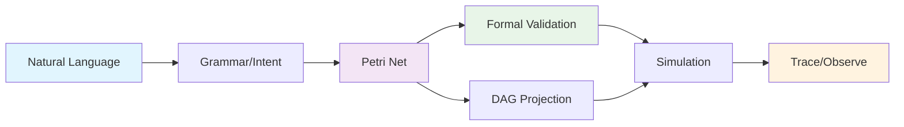

# Vision: Natural Language to Formal Workflows

## Positioning Statement

Obvian provides a horizontal trust layer that transforms natural language workflow descriptions into formally validated, traceable execution paths. By bridging the gap between human intent and machine execution, we enable reliable automation with complete observability and mathematical guarantees.

## The Problem

Modern workflows are complex, distributed, and often undocumented. Teams struggle with:

- **Intent-Implementation Gap**: Natural language requirements become brittle code
- **Validation Challenges**: No formal verification of workflow correctness before deployment
- **Observability Gaps**: Limited visibility into execution paths and failure modes
- **Trust Deficits**: Uncertainty about automated system behavior and reliability

## Our Solution

### Core Flow: NL → Grammar → Petri Net → DAG → Validate → Simulate/Trace

### 1. Natural Language Understanding
Transform human workflow descriptions into structured representations:
- Template-based parsing for reliability and predictability
- Domain-specific patterns (DevOps, Training, Business Processes)
- Clear error messages and suggestions for unsupported constructs

### 2. Formal Modeling with Petri Nets
Convert structured intents into mathematically rigorous models:
- **Places**: States and resources in the workflow
- **Transitions**: Actions and decision points
- **Tokens**: Work items flowing through the system
- **Arcs**: Dependencies and causality relationships

### 3. Formal Validation
Provide mathematical guarantees about workflow behavior:
- **Deadlock Detection**: Identify states where progress is impossible
- **Reachability Analysis**: Verify all intended outcomes are achievable
- **Liveness Properties**: Ensure critical actions can always eventually occur
- **Boundedness Checking**: Prevent resource exhaustion scenarios

### 4. Dual Visualization
Present workflows in both formal and intuitive representations:
- **Petri Net View**: Complete formal model with places, transitions, and token flow
- **DAG View**: Simplified execution order for stakeholder communication
- **Cross-Highlighting**: Synchronized interaction between both views

### 5. Simulation and Tracing
Execute workflows with complete observability:
- **Token Animation**: Visual representation of work item flow
- **Deterministic Replay**: Reproducible execution with seeded randomness
- **Comprehensive Tracing**: Complete audit trail of all state transitions
- **Interactive Debugging**: Step-through execution with decision points

## Value Propositions

### For DevOps Teams
- **Workflow Validation**: Catch CI/CD pipeline issues before deployment
- **Visual Documentation**: Clear representation of complex deployment flows
- **Failure Analysis**: Trace execution paths to identify bottlenecks and failures
- **Compliance**: Formal verification of regulatory and security requirements

### For Business Process Analysts
- **Process Modeling**: Transform business requirements into executable workflows
- **Optimization**: Identify inefficiencies and improvement opportunities
- **Stakeholder Communication**: Visual models bridge technical and business domains
- **Change Management**: Validate process modifications before implementation

### For Training and Education
- **Workflow Design**: Teach formal methods through intuitive interfaces
- **Scenario Planning**: Model and validate training procedures and protocols
- **Knowledge Transfer**: Document complex procedures in executable form
- **Assessment**: Verify understanding through workflow construction exercises

## Obvian as Horizontal Trust Layer

### Trust Through Transparency
- **Complete Traceability**: Every execution step is logged and auditable
- **Formal Guarantees**: Mathematical proofs of workflow properties
- **Visual Validation**: Stakeholders can verify behavior before deployment
- **Deterministic Behavior**: Same inputs always produce same outputs (when configured)

### Horizontal Integration
- **Domain Agnostic**: Same core engine works across DevOps, business processes, training
- **Plugin Architecture**: Extensible to new domains and execution environments
- **Standard Interfaces**: Consistent API across all workflow types
- **Export Capabilities**: Integration with existing tools and systems

### Risk Mitigation
- **Early Detection**: Find issues during design, not deployment
- **Bounded Exploration**: Prevent infinite loops and resource exhaustion
- **Graceful Degradation**: Clear error messages and recovery suggestions
- **Audit Trail**: Complete history for compliance and debugging

## Competitive Advantages

### Technical Differentiation
1. **Formal Methods Foundation**: Mathematical rigor typically reserved for safety-critical systems
2. **Natural Language Interface**: Accessible to non-technical stakeholders
3. **Dual Representation**: Both formal precision and intuitive visualization
4. **Complete Observability**: Token-level tracing with causality preservation

### Market Positioning
- **Workflow Engines**: Add formal validation and natural language interfaces
- **Process Mining Tools**: Provide prescriptive modeling, not just descriptive analysis
- **Documentation Platforms**: Make documentation executable and verifiable
- **Training Systems**: Add formal verification to procedural learning

## Success Metrics

### Technical Metrics
- **Validation Accuracy**: Percentage of real issues caught during formal analysis
- **Performance**: Sub-2s end-to-end latency for typical workflows
- **Scalability**: Support for workflows up to 100+ nodes
- **Reliability**: 99.9% uptime for validation and simulation services

### Business Metrics
- **Adoption Rate**: Number of workflows modeled and validated per month
- **Error Reduction**: Decrease in production workflow failures
- **Time to Value**: Reduction in workflow design and debugging time
- **User Satisfaction**: Net Promoter Score from workflow designers

## Future Roadmap

### Phase 1: Proof of Concept (Current)
- Template-based natural language parsing
- Core Petri net engine with validation
- Dual visualization with simulation
- Two demo scenarios (DevOps, Football)

### Phase 2: Production Ready
- Advanced natural language understanding
- Real plugin integrations and execution
- Multi-user collaboration features
- Enterprise security and compliance

### Phase 3: AI-Enhanced
- Machine learning for workflow optimization
- Predictive failure analysis
- Automated workflow generation from examples
- Intelligent suggestion and completion

### Phase 4: Ecosystem
- Marketplace for workflow templates and plugins
- Integration with major workflow platforms
- Industry-specific solutions and partnerships
- Open source community development

## Call to Action

The future of reliable automation requires formal methods made accessible. Obvian bridges the gap between human intent and machine execution, providing the trust layer that modern distributed systems desperately need.

**Join us in building workflows that work—every time.**